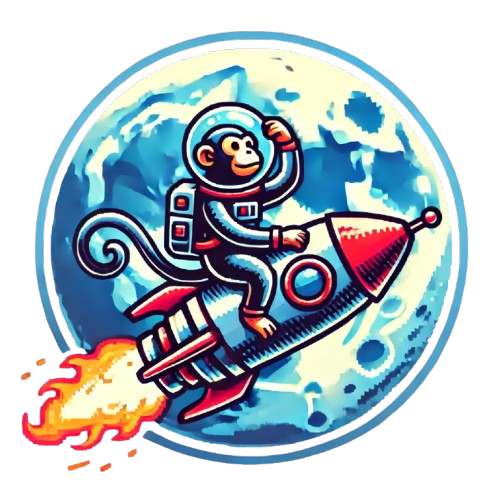

<article class="markdown-body entry-content container-lg" itemprop="text">
    

    

        
    

    
<h1 tabindex="-1" class="heading-element" dir="auto">MoonkeyEU Feedback</h1>

    

    
We strive to make MoonkeyEU the best space launch tracker. To make that happen we need your help to find and catch bugs that we might miss! Tell us about bugs or features you'd like to have implemented or changed!

    

        <h2 tabindex="-1" class="heading-element" dir="auto">Site Sections</h2>
    

    <ul dir="auto">
        <li><a href="https://www.moonkeyeu.com/launches" rel="nofollow">Main Site</a> - Explore all space launches, astronauts and more.</li>
        <li><a href="https://www.moonkeyeu.com/vehicles" rel="nofollow">Vehicles Section</a> - Explore boosters, rockets and more.</li>
        <li><a href="https://www.moonkeyeu.com/bookmarks" rel="nofollow">Bookmarks Section</a> - Save and manage your bookmarked launches.</li>
    </ul>
    
Please give examples when reporting bugs!

    <a dir="auto" href="https://github.com/Nikos-Michelis/MoonkeyEu/issues/new"> + NEW ISSUE </a>
</article>
